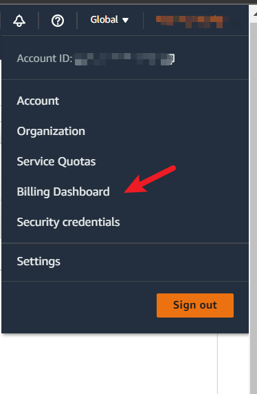
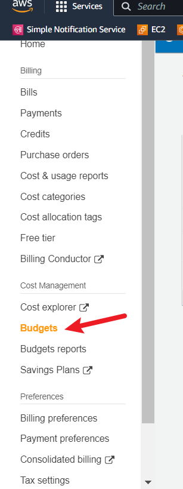

# Billing, Architecture, Security

##  Destroy your root account credentials, Set MFA, 

## Create an IAM user
- Sign in to the AWS Management Console with your root account credentials.
Navigate to the IAM service console.
- Click on the "Users" link in the left-hand menu and then click the "Add user" button.
- Enter a name for the user in the "User name" field.
- Select the "Programmatic access" and/or "AWS Management Console access" checkboxes to grant the user access to AWS resources via the AWS CLI, SDKs, or the AWS Management Console.
- If you select "AWS Management Console access", choose whether to create a custom password or allow the user to create their own password.
- Click "Next: Permissions".
- In the "Set permissions" step, you want to grant budget and cost alert permissions.
- Click on the "Permissions" tab and click the "Attach policies" button.
- In the search bar, search for "AWSBudgetsFullAccess" policy and select it.
- Click on "Attach policy".
The "AWSBudgetsFullAccess" policy grants the user full access to create, edit and delete budgets and also to receive budget notifications.
- Click "Next: Tags" to add tags to the user (optional).
- Click "Next: Review" to review your settings, and then click "Create user" to create the IAM user.

# MFA
Multifactor authentication (MFA) is a security technology that requires multiple methods of authentication from independent categories of credentials to verify a user's identity for a login or other transaction.
Never, ever, use your root account for everyday use. Instead, head to [Identity and Access Management (IAM)](https://youtu.be/OdUnNuKylHg?t=967) and create an administrator user. 

- Protect and lock your root credentials in a secure place 
You will absolutely want to activate Multi Factor Authentication (MFA) too for your root account. And you won’t use this user unless strictly necessary.

- Now, about your newly created admin account, activating MFA for it is a must. It’s actually a requirement for every user in your account if you want to have a security first mindset.

-  Now we set up MFA for the [user](https://docs.aws.amazon.com/IAM/latest/UserGuide/id_credentials_mfa_enable_virtual.html)

- we can login into our IAM user after inputing the MFA code 

## Seting up AWS Budgets, AWS Cost Explorer, Billing Alarms

- Go to billing 

- click on budget and create budget

## Use EventBridge to hookup Health Dashboard to SNS and send notification when there is a service health issue.

EventBridge is a serverless service that uses events to connect application components together, making it easier for you to build scalable event-driven applications.
Use it to route events from sources such as home-grown applications, AWS services, and third- party software to consumer applications across your organization.
EventBridge provides a simple and consistent way to ingest, filter, transform, and deliver events so you can build new applications quickly. 
##  Create an architectural diagram (to the best of your ability) the CI/CD logical pipeline in Lucid Charts

- I was able to set up a billing alarm
- I was able to set up aws budget 
- I destroyed my root account credentials and was able to Set MFA & IAM role

- Review all the questions of each pillars in the Well Architected Tool (No specialized lens)

- 